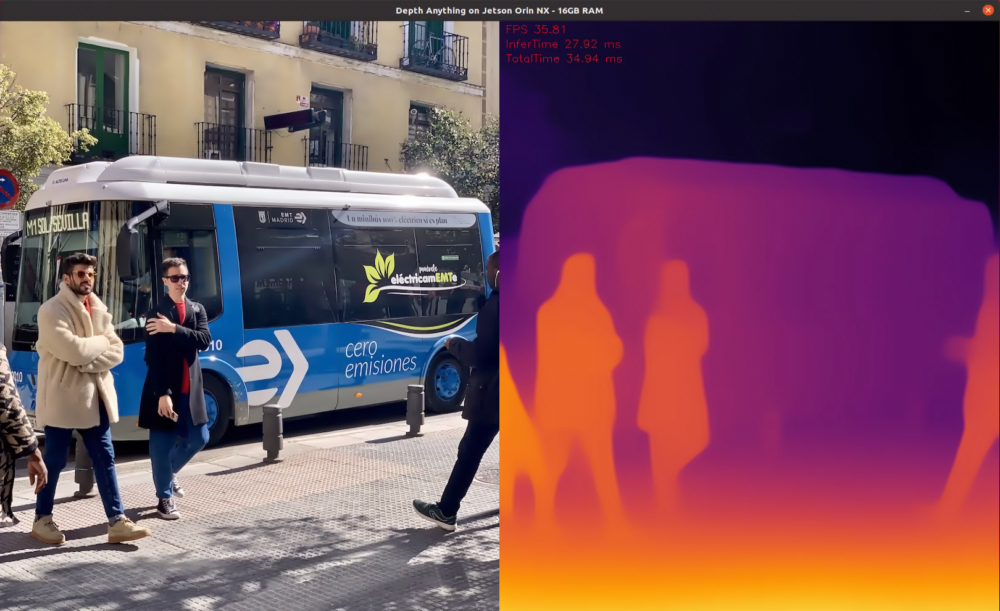
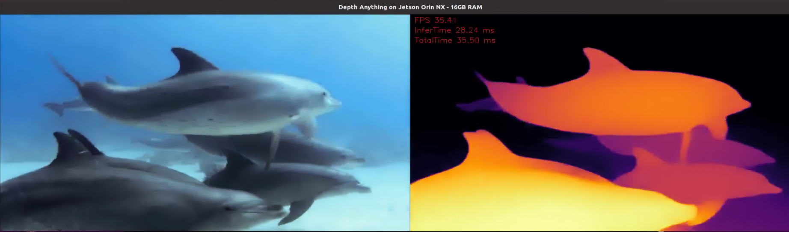
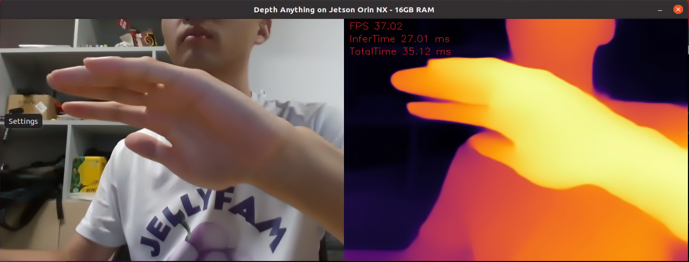

# Prerequisites

## Hardware

- Jetson Orin NX 8GB or higher
- Intel Realsense D435i

## Software

- JetPack 5.1.1
- OpenCV 4.10.0-dev with CUDA: YES
- CUDA 11.4.315
- cuDNN 8.6.0.166
- TensorRT 8.5.2.2
- librealsense 2.55.1.0
  - installation guide: https://github.com/IntelRealSense/librealsense/blob/master/doc/installation_jetson.md
  - command to check libreasense version: `sudo dpkg -l | grep librealsense` or  `realsense-viewer --version`

# Building the Project

## Cloning the Repository

``` bash
git clone https://github.com/kyrie2to11/Depth-Anything-for-Jetson-Orin-CPP.git
```

## Build the Tensor RT engine 

``` bash
cd ./engine
trtexec --onnx=depth_anything_vits14_364.onnx --saveEngine=depth_anything_vits14_364.engine --fp16 
```

## Build using CMake

``` bash
# switch to the project directory
cd xxx/Depth-Anything-for-Jetson-Orin-CPP

# create build directory：./build
cmake -S . -B build

# build the project
cmake --build build

```

## Running the Demo

``` bash
# usage: 
./depth_anything_cpp [model_trt_engine_path] [--stream or --image or --video] [camera_id (optional:0) or image_path or video path]

# examples:
# 1. run with picture input
./depth_anything_cpp ./engine/depth_anything_vits14_364.engine --image ./test_video_picture/bus.jpg

# 2. run with video input
./depth_anything_cpp ./engine/depth_anything_vits14_364.engine --video ./test_video_picture/davis_dolphins.mp4

# 3. run with live realsense camera input
./depth_anything_cpp ./engine/depth_anything_vits14_364.engine --stream 0
``` 

# Result Shortcuts
1. run with picture input


2. run with video input:


3. run with live realsense camera input:

